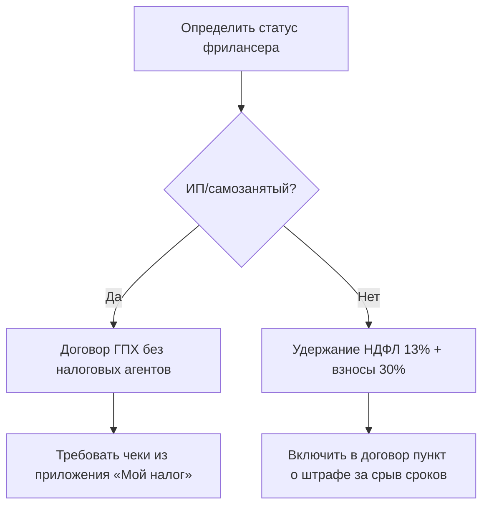

### Договоры ГПХ с фрилансерами
**Ошибки заказчиков:**  
- Неверный выбор статуса исполнителя (физлицо vs ИП);  
- Отсутствие чеков от самозанятых → риск доначисления налогов .  

**Инструкция для заказчика:**  

### 6. Договоры ГПХ с фрилансерами
**Ошибки заказчиков:**  
- Неверный выбор статуса исполнителя (физлицо vs ИП);  
- Отсутствие чеков от самозанятых → риск доначисления налогов .  

**Инструкция для заказчика:**  
